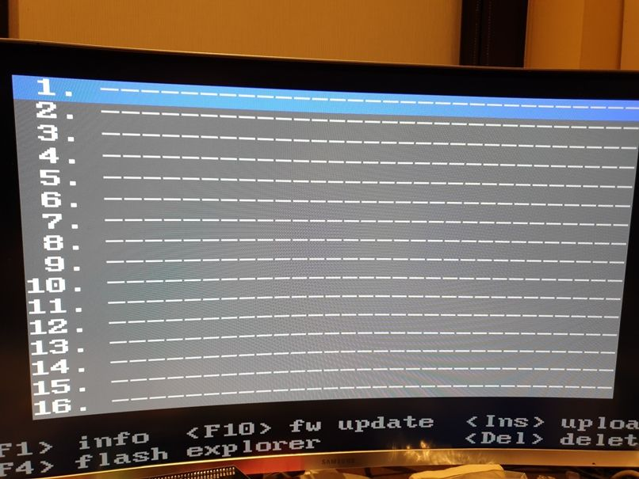
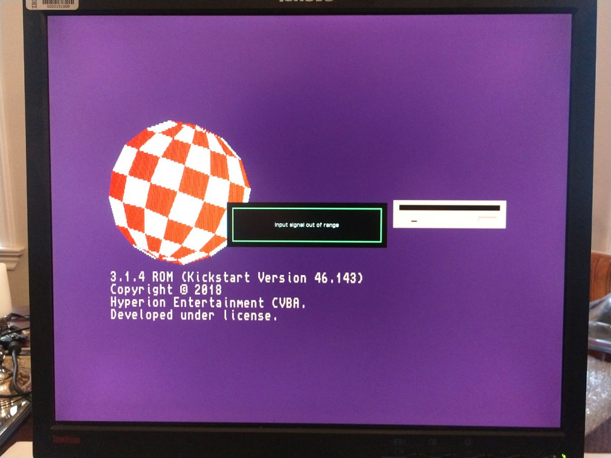

# DIY-A586 by piotr_go

## Board

## Schematic

## Menu of main core

## Running Minimig core

## Links

* https://www.elektroda.com/rtvforum/topic3598849.html or https://www.elektroda.de/rtvforum/topic3598849.html
* https://www.diy-a586.com/
* https://www.youtube.com/watch?v=OAxe3ryDPwQ&list=PLbiryfyA62EBfDKSVf1hBP-nj-KQiV575

