# DIY-A586 by Piotr Gozdur <piotr_go>

- [Board](#board)
- [Schematic](#schematic)
- [Menu of main core](#menu-of-main-core)
- [Available cores](#available-cores)
- [Running Minimig core](#running-minimig-core)
- [Initial flashing of the firmware](#initial-flashing-of-the-firmware)
  - [Using CH341A 24 25 Series EEPROM Flasher](#using-ch341a-24-25-series-eeprom-flasher)
- [Gotek Floppy Emulator](#gotek-floppy-emulator)
- [Floppy splitter](#floppy-splitter)
  - [Floppy splitter board](#floppy-splitter-board)
  - [Floppy splitter schematic](#floppy-splitter-schematic)
  - [Programming the PIC16F15313](#programming-the-pic16f15313)
  - [Pinout PIC16F15313](#pinout-diagram-pic16f15313)
  - [Pinout PICkit3](#pinout-pickit3)
- [Links](#links)

## Board

[Gerber files](pcb/v1.6/gerbers.tar.gz) and [main core](main/MAIN%20v0.4.3.tar.gz) included.

> © DIY-A586 by Piotr Gozdur. COMMERCIAL USE NOT ALLOWED!

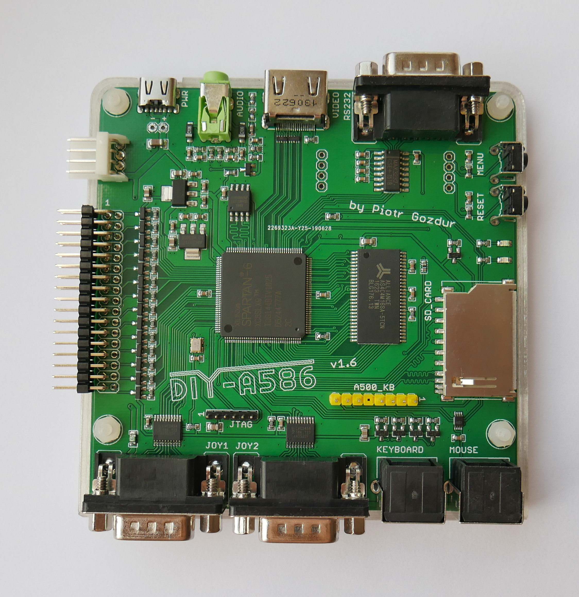
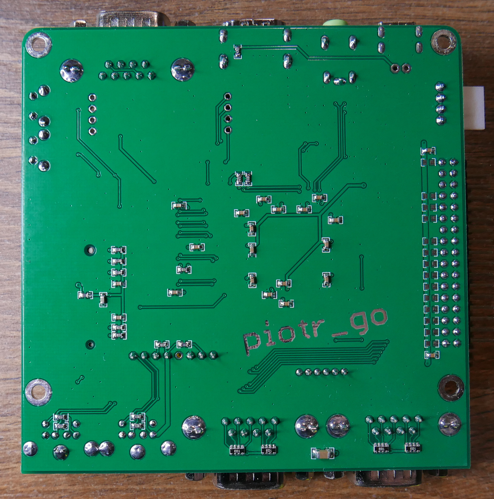

## Schematic


## Menu of main core
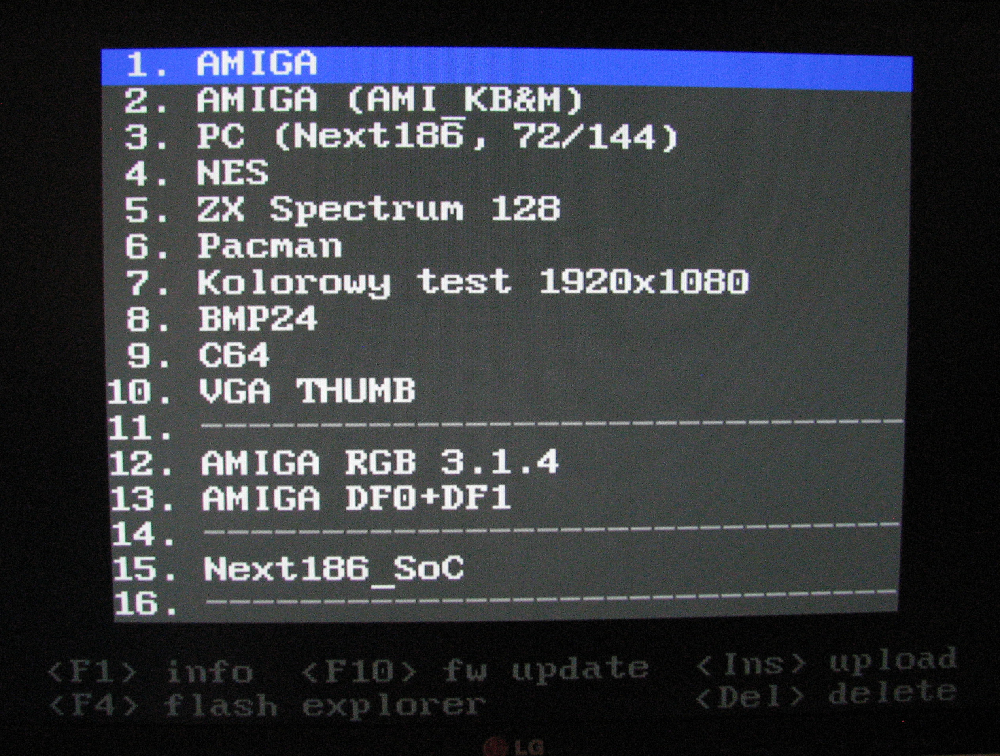

## Available cores

* Amiga (Minimig)
* NES
* Next186 SoC PC
* RISC-V
* Sinclair Spectrum

## Running Minimig core
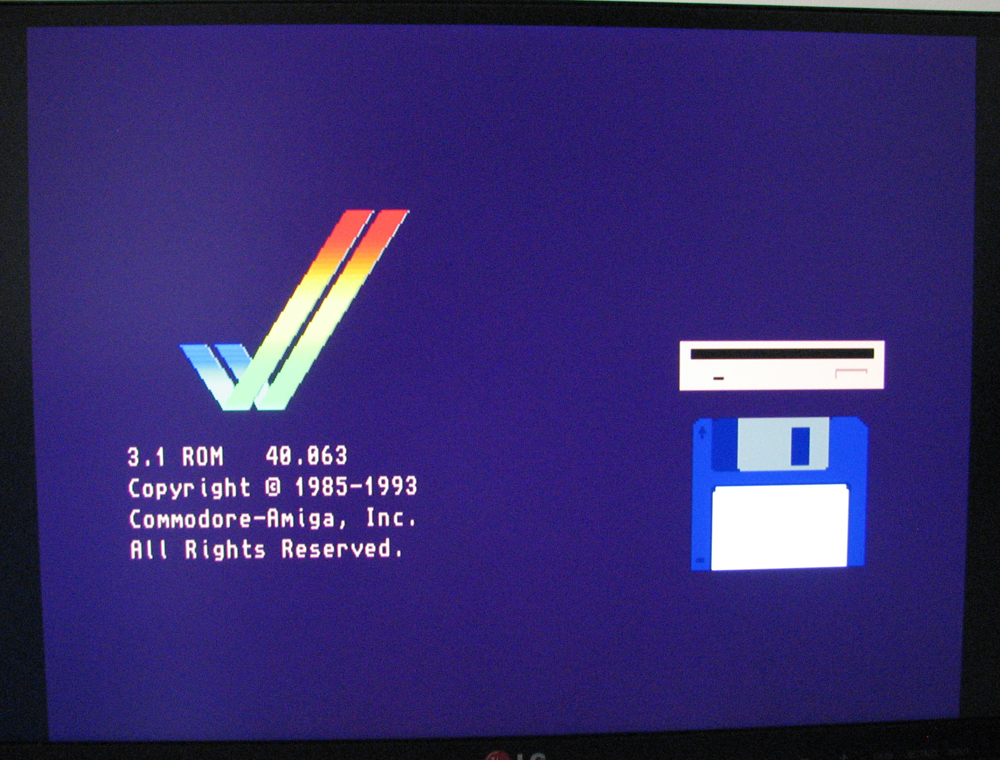
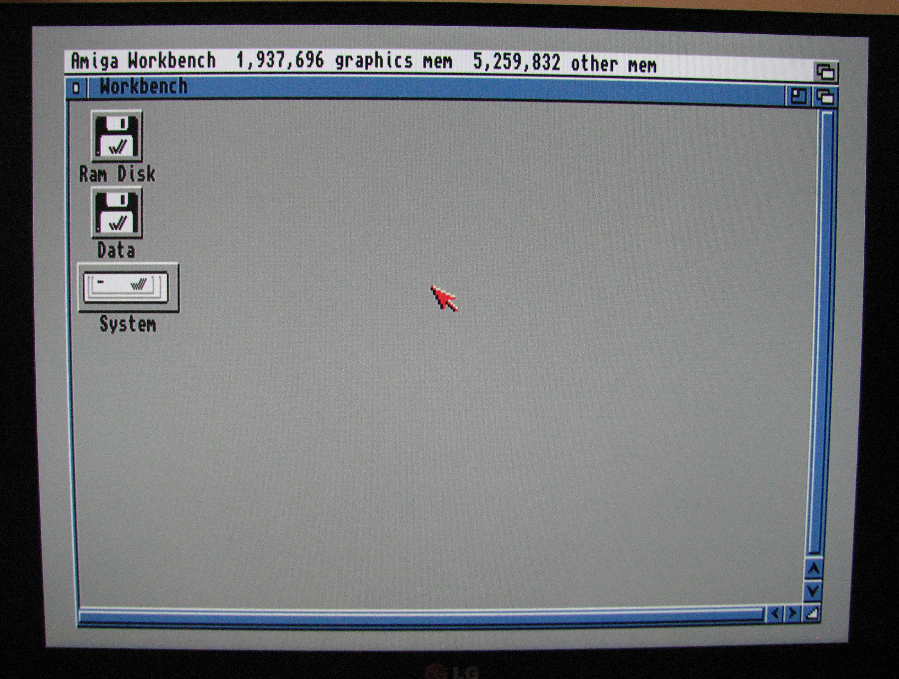

## Initial flashing of the firmware

### Using CH341A 24 25 Series EEPROM Flasher

This shows the initial flashing with the CH341A programmer on Ubuntu using the [flashrom tool](https://manpages.ubuntu.com/manpages/focal/man8/flashrom.8.html).

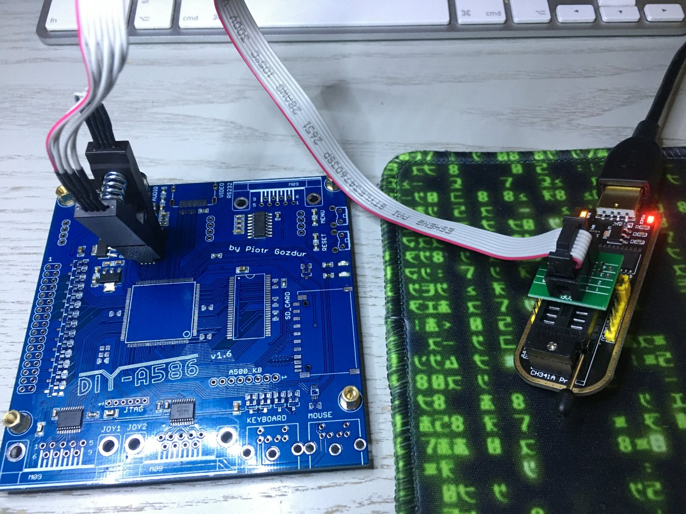
flashrom has the weird behaviour that the bin file must have the exact size of the flash rom. This can be fixed with the following workaround:

* read empty flash and write to local .bin file: ```sudo flashrom --programmer ch341a_spi -r example.bin```
* copy main.bin into example.bin with: ```dd if=main.bin of=example.bin conv=notrunc```
* check result: ```vbindiff main.bin example.bin```

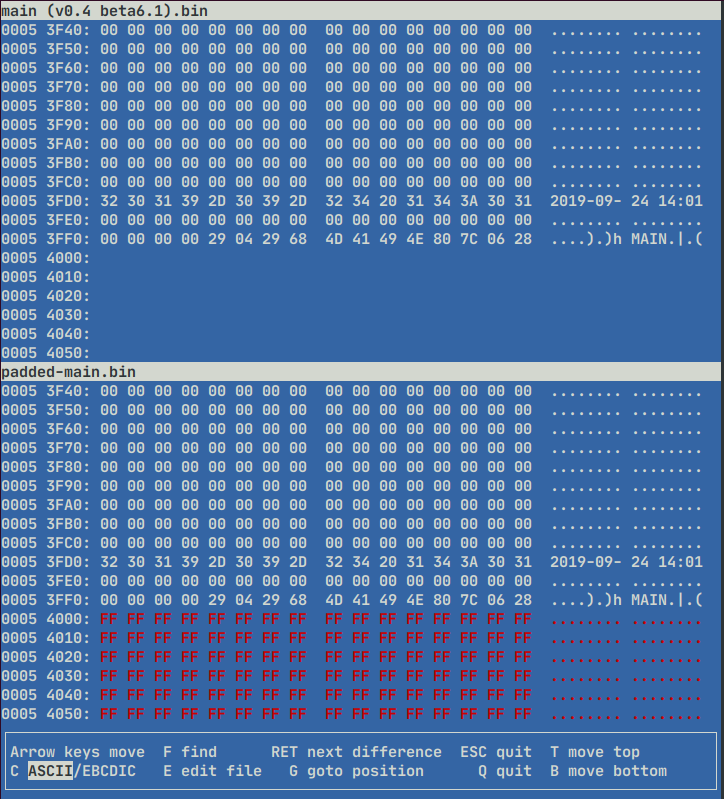

* now you have a bin file with correct size to flash: ```sudo flashrom --programmer ch341a_spi -w example.bin```
* you're done ;o)

> Change the example filenames above to your needs respectively to current main.bin version!

## Gotek Floppy Emulator

If you are using a Gotek drive with FlashFloppy, don't copy files **HXCSDFE.CFG** and **AUTOBOOT.HFE** to the USB stick. The FlashFloppy/HxC File Selector will not work with DIY-A586. Copy only the **.adf** files to the USB stick and select the files with buttons or the rotary knob.

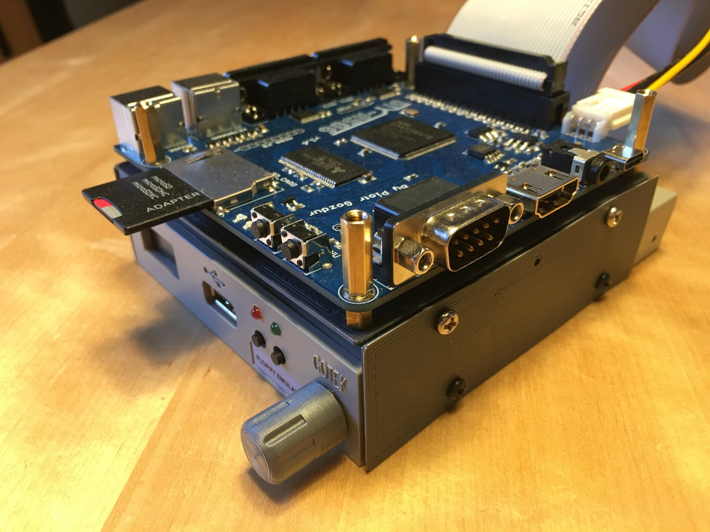

## Floppy splitter
With an attached floppy splitter you can attach up to two floppy drives to the DIY-A586 used by the [Amiga Minimig core](cores/amiga/minimig/v0.3/amiga_v0.3_src.tar.gz).

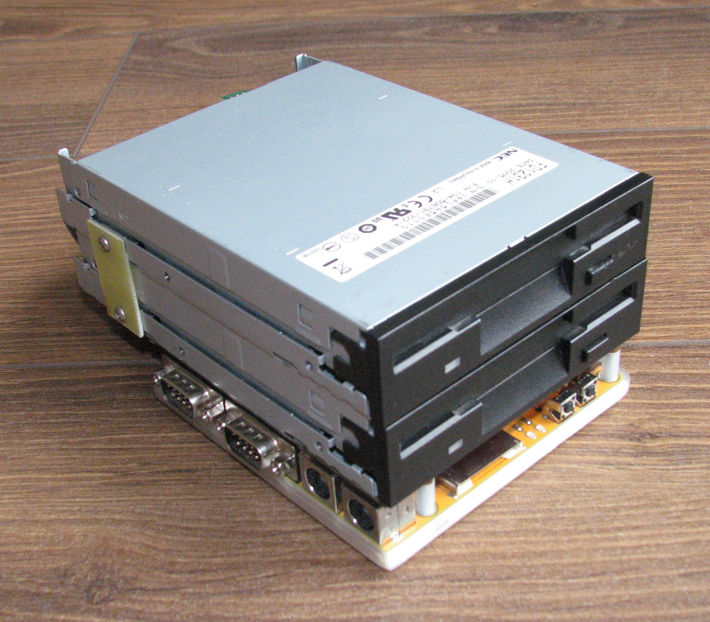

### Floppy splitter board

Gerber files and PIC16F15313 firmware [included](cores/amiga/amiga_floppy_splitter%20v0.1%20by%20piotr_go.tar.gz).

> © Floppy Splitter by Piotr Gozdur. COMMERCIAL USE NOT ALLOWED!

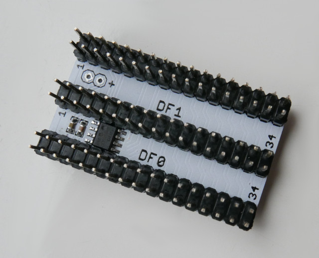

### Floppy splitter schematic

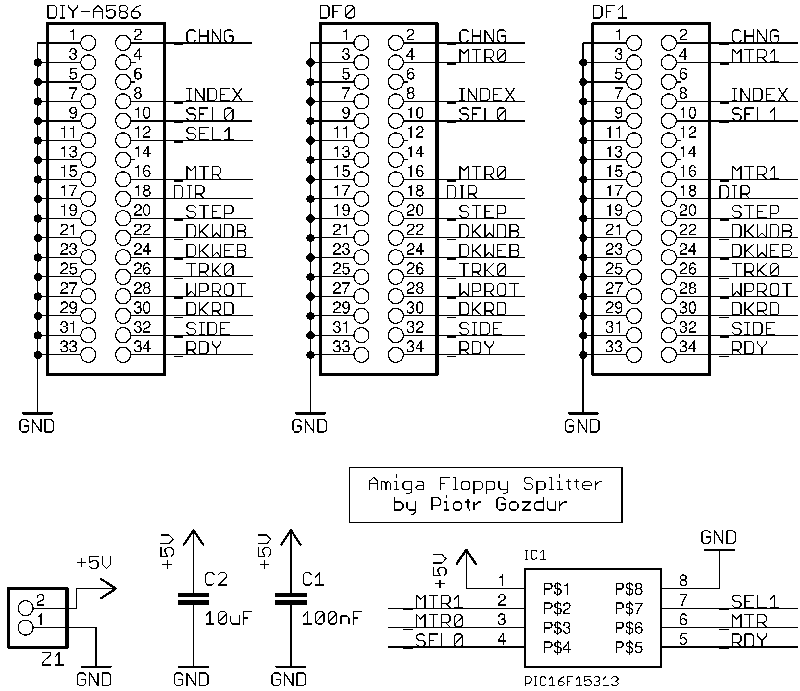

### Programming the PIC16F15313

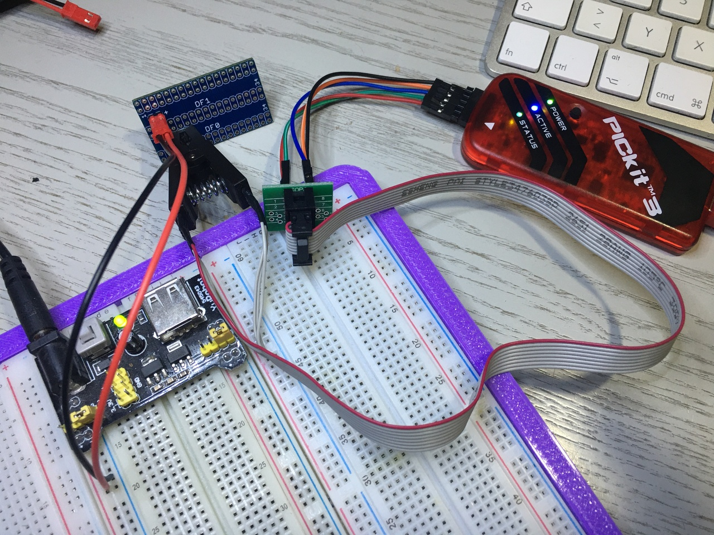

Connect the PIC16F15313 to an PICkit3 programmer. The PIC16F15313 needs additional power (it didn't work for me without it).

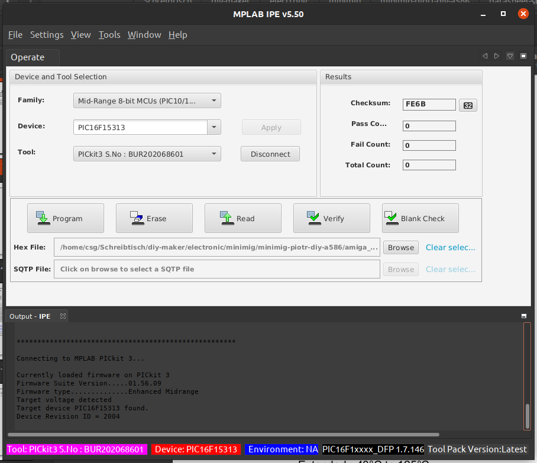

Using MPLAB IPE to programm the HEX file of the floppy-splitter. See settings in screenshot. Select the hex file and press "Program".

### Pinout diagram PIC16F15313

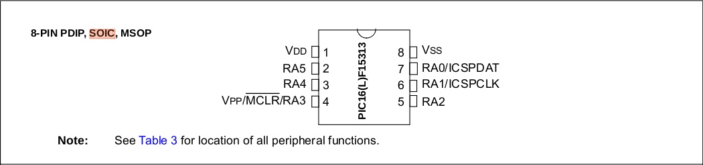

### Pinout PICkit3

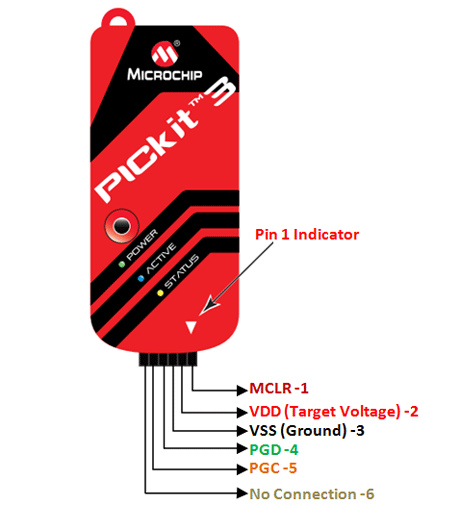

## Links
* https://www.elektroda.com/rtvforum/topic3598849.html or\
  https://www.elektroda.pl/rtvforum/topic3598849.html or\
  https://www.elektroda.de/rtvforum/topic3598849.html
* https://www.youtube.com/watch?v=OAxe3ryDPwQ&list=PLbiryfyA62EBfDKSVf1hBP-nj-KQiV575
