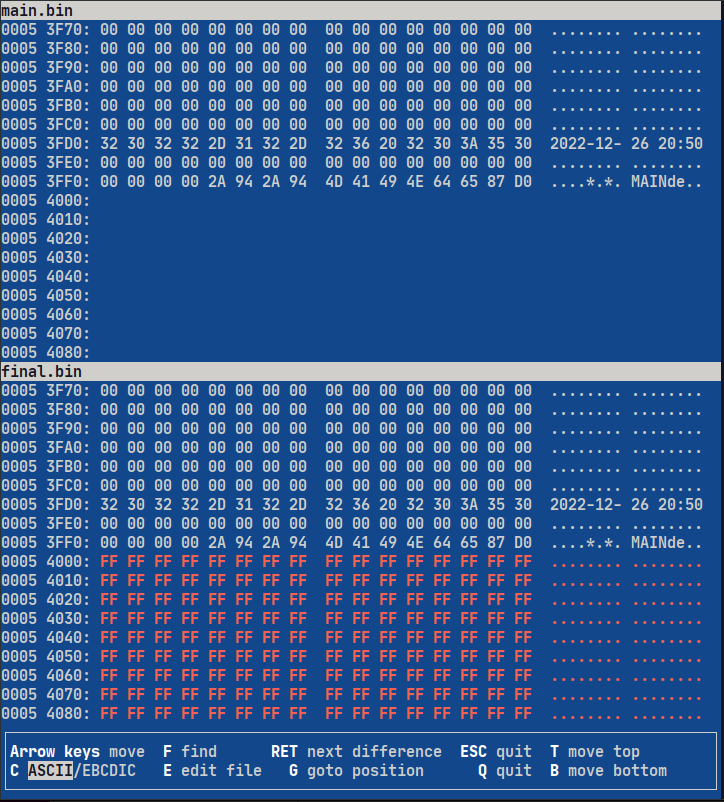

# DIY-A586 v1.9 by Piotr Gozdur <piotr_go>
© COMMERCIAL USE NOT ALLOWED!

- [DIY-A586 v1.9 by Piotr Gozdur \<piotr\_go\>](#diy-a586-v19-by-piotr-gozdur-piotr_go)
  - [Board](#board)
  - [Schematic](#schematic)
  - [Menu of main core](#menu-of-main-core)
  - [Available cores](#available-cores)
  - [Running Minimig core](#running-minimig-core)
  - [Initial flashing of the firmware](#initial-flashing-of-the-firmware)
    - [Using CH341A 24 25 Series EEPROM Flasher](#using-ch341a-24-25-series-eeprom-flasher)
    - [detailed example of how to flash](#detailed-example-of-how-to-flash)
  - [Gotek Floppy Emulator](#gotek-floppy-emulator)
  - [Links](#links)

## Board
[Gerber files](pcb/v1.9/gerbers.tar.gz) and [main core](main/MAIN%20v0.4.4a.tar.gz) included.


## Schematic


## Menu of main core


## Available cores
* Amiga (Minimig)
* NES

## Running Minimig core


## Initial flashing of the firmware

### Using CH341A 24 25 Series EEPROM Flasher

This shows the initial flashing with the CH341A programmer on Ubuntu using the [flashrom tool](https://manpages.ubuntu.com/manpages/focal/man8/flashrom.8.html).


flashrom has the weird behaviour that the bin file must have the exact size of the flash rom. This can be fixed with the following workaround:

* read empty flash and write to local .bin file: ```sudo flashrom --programmer ch341a_spi -r example.bin```
* copy main.bin into example.bin with: ```dd if=main.bin of=example.bin conv=notrunc```
* check result: ```vbindiff main.bin example.bin```



* now you have a bin file with correct size to flash: ```sudo flashrom --programmer ch341a_spi -w example.bin```
* you're done ;o)

> Change the example filenames above to your needs respectively to current main.bin version!

### detailed example of how to flash

```bash
# read the contents of current soldered empty flash memory
csg@csg-deskmini-300:~/git/DIY-A586/v1.9/main$ sudo flashrom --programmer ch341a_spi -r empty.bin
[sudo] Passwort für csg: 
flashrom v1.2 on Linux 5.15.0-73-generic (x86_64)
flashrom is free software, get the source code at https://flashrom.org

Using clock_gettime for delay loops (clk_id: 1, resolution: 1ns).
Found Winbond flash chip "W25Q128.V" (16384 kB, SPI) on ch341a_spi.
Reading flash... done.

# make copy of empty rom file
csg@csg-deskmini-300:~/git/DIY-A586/v1.9/main$ cp empty.bin final.bin

# copy main.bin into final.bin rom file
csg@csg-deskmini-300:~/git/DIY-A586/v1.9/main$ dd if=main.bin of=final.bin conv=notrunc
672+0 Datensätze ein
672+0 Datensätze aus
344064 Bytes (344 kB, 336 KiB) kopiert, 0,00142343 s, 242 MB/s

# use vbindiff to show result of dd command. see screenshot above.
csg@csg-deskmini-300:~/git/DIY-A586/v1.9/main$ vbindiff main.bin final.bin 
VBinDiff 3.0_beta5, Copyright 1995-2017 Christopher J. Madsen
VBinDiff comes with ABSOLUTELY NO WARRANTY; for details type 'vbindiff -L'.

# write final.bin file to rom
csg@csg-deskmini-300:~/git/DIY-A586/v1.9/main$ sudo flashrom --programmer ch341a_spi -w final.bin 
flashrom v1.2 on Linux 5.15.0-73-generic (x86_64)
flashrom is free software, get the source code at https://flashrom.org

Using clock_gettime for delay loops (clk_id: 1, resolution: 1ns).
Found Winbond flash chip "W25Q128.V" (16384 kB, SPI) on ch341a_spi.
Reading old flash chip contents... done.
Erasing and writing flash chip... Erase/write done.
Verifying flash... VERIFIED.

# optional: verify again if wanted.
csg@csg-deskmini-300:~/git/DIY-A586/v1.9/main$ sudo flashrom --programmer ch341a_spi -v final.bin 
flashrom v1.2 on Linux 5.15.0-73-generic (x86_64)
flashrom is free software, get the source code at https://flashrom.org

Using clock_gettime for delay loops (clk_id: 1, resolution: 1ns).
Found Winbond flash chip "W25Q128.V" (16384 kB, SPI) on ch341a_spi.
Verifying flash... VERIFIED.
```

## Gotek Floppy Emulator

If you are using a Gotek drive with FlashFloppy, don't copy files **HXCSDFE.CFG** and **AUTOBOOT.HFE** to the USB stick. The FlashFloppy/HxC File Selector will not work with DIY-A586. Copy only the **.adf** files to the USB stick and select the files with buttons or the rotary knob.


## Links
* https://www.elektroda.pl/rtvforum/topic3891155.html
* https://youtu.be/KzVHhvZciVI

<br><b>If you like my projects, you can support me with a donation.&nbsp;&nbsp;</b>
[](https://www.paypal.com/donate/?business=8PFDDCVKKCSP6&no_recurring=0&currency_code=USD)
<b>&nbsp;&nbsp;Thank you.</b><br>
