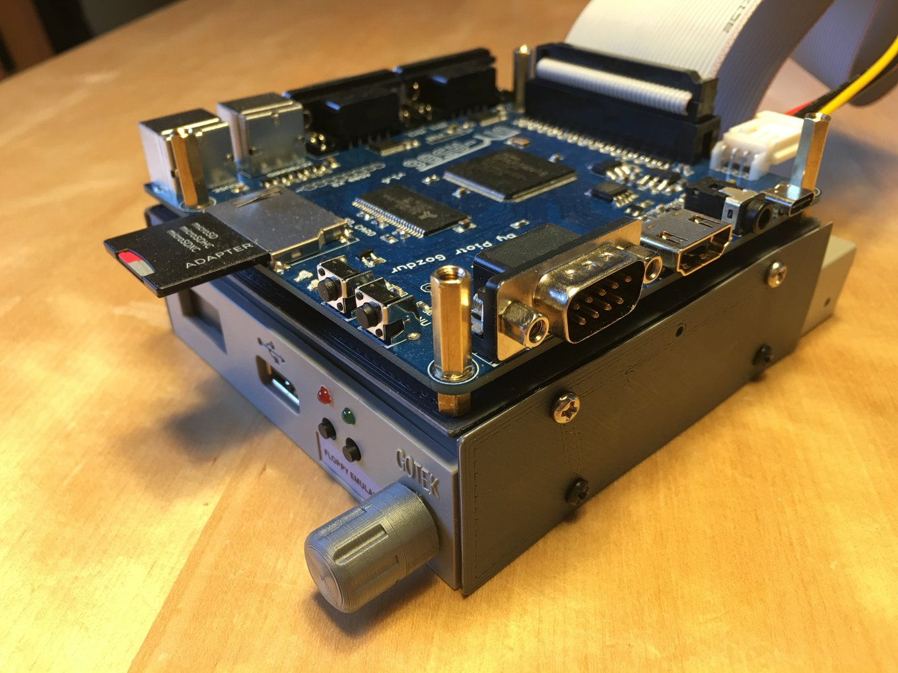

# Amiga core


<!-- no toc -->
- [Gotek Floppy Emulator](#gotek-floppy-emulator)
- [SD Card Amiga OS preparation howto](#sd-card-amiga-os-preparation-howto)
  - [Creating a HDF harddisk image file](#creating-a-hdf-harddisk-image-file)
  - [Setup UAE and HDToolBox](#setup-uae-and-hdtoolbox)
  - [Reboot after partitioning, formatting partitions, install Amiga OS](#reboot-after-partitioning-formatting-partitions-install-amiga-os)
  - [Writing HDF file to SD Card](#writing-hdf-file-to-sd-card)
  - [Boot DIY-A586 with SD Card](#boot-diy-a586-with-sd-card)

## Gotek Floppy Emulator
Copy only the **.adf** files to the USB stick and select the files with buttons or the rotary knob.


## SD Card Amiga OS preparation howto

Following there is a rough description how to setup a SD Card with Amiga OS for DIY-A586  
using the amiga core with patched kickstart rom.  
For this you need a little help from [WinUAE](https://www.winuae.net/) or [FS-UAE](https://fs-uae.net/) installed on Win, macOS or Linux.

### Creating a HDF harddisk image file

To start you need an Amiga HDF file. This can be created e.g. under [FS-UAE](https://fs-uae.net/) with the ```HDF Disk Image Creator``` tool.  


Choose ```Partitionable Hard Drive Image (RDB)```. See screenshot. Setup the rest to your needs. 4096 MB is a good choice.  
> If you want more you have to keep the max partition size of used Amiga filesystem in mind.

### Setup UAE and HDToolBox

Setup your amiga emulator of choice using needed Amiga OS install discs (ADF) and the new created HDF file.  
Boot up UAE with Workbench install disc. Open the Tools window located on install disk. Select ```HDToolBox``` icon.  
Then got to menu ```Icon/Information```. In the following window click ```SCSI_DEVICE_NAME``` and change ```scsi.device``` to ```uaehf.device```.


Save and open ```HDToolBox``` again. You should see now a harddrive in the list.  
> If not you have to use ```Change Drive Type```. Hard to describe just look here: [Setup Amiga Hard Drive using FS-UAE](https://www.youtube.com/watch?v=88jxTQo4uhs)


Click on ```Partition Drive```. In the following window just partition the harddrive to your needs.  
For example there are three partitions: ```System DH0 (0.5GB)```, ```Work DH1 (1.8GB)``` and ```Data DH2 (1.7GB)```


> More detailed partitioning info see here: [Setup Amiga Hard Drive using FS-UAE](https://www.youtube.com/watch?v=88jxTQo4uhs)

If your partitioning is done press ```Save Changes to Drive```.

### Reboot after partitioning, formatting partitions, install Amiga OS

After partitioning reboot UAE. You should see now for example unformatted harddrives ```DH0:NDOS``` and so on.  
You can quick format each partition. Select partition icon and go to menu ```Icons/Format Disk...```  


Give it a proper name and press ```Quick Format```. If all partitions are formatted you can install Amiga OS  
from the install disks. Install additional software over shared folders or from other ADF/HDF drives.

### Writing HDF file to SD Card

If your HDF file is prepared write it with e.g. the ```Raspberry Pi Imager``` to SD Card.  


First step is to choose your operating system -> select ```own image```.  
Navigate to the folder where HDF file is located and switch filetype to ```All files```.  
Select HDF file, choose target SD Card and click write.

### Boot DIY-A586 with SD Card 

Insert now SD Card into DIY-A586. Needed patched kickstart e.g. ```KICK31SD.ROM``` must be available in onboard flash rom.  
Start amiga core with ```kickstart 3.1 + SD```.